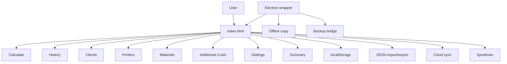
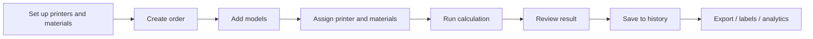
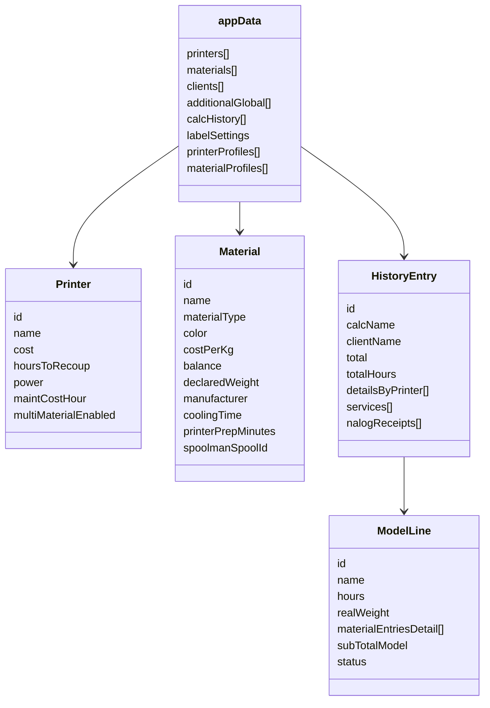
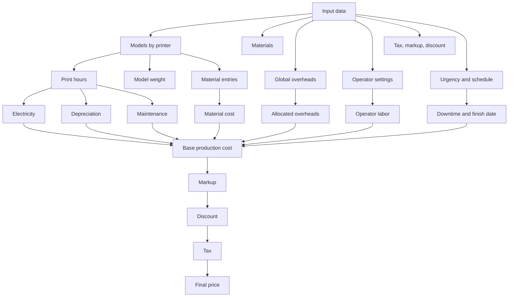
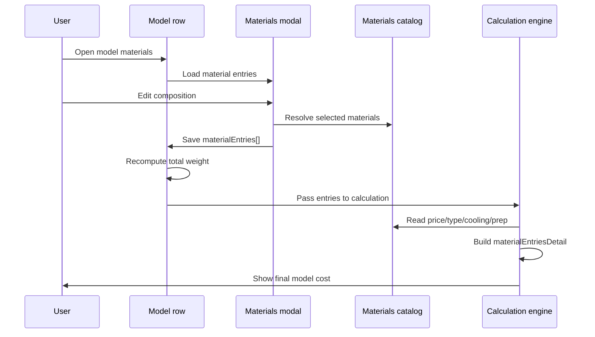
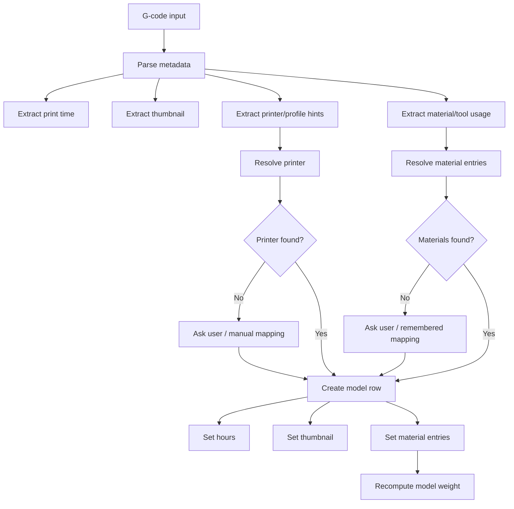
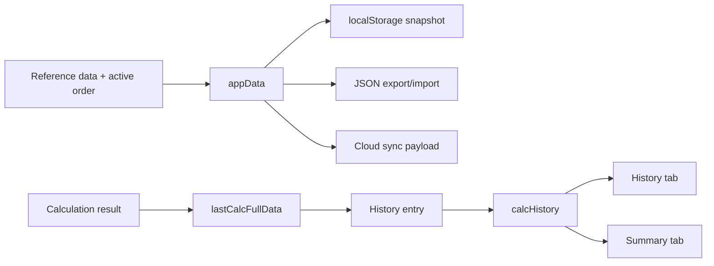
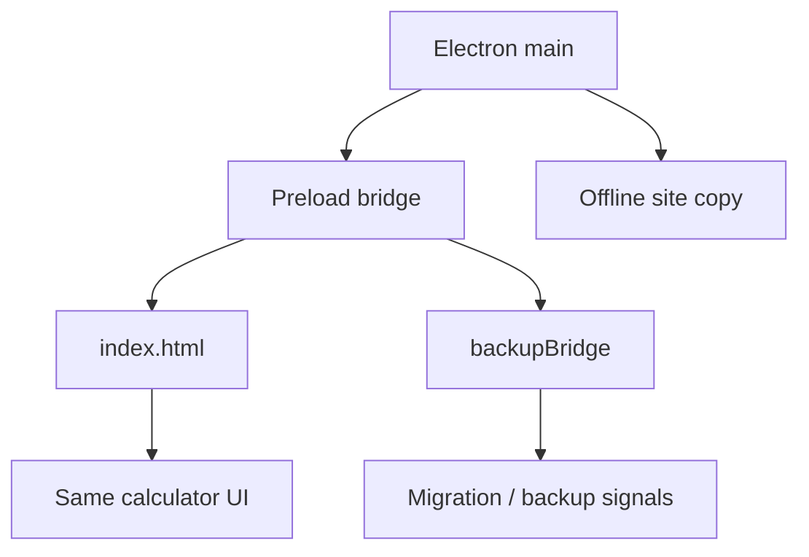
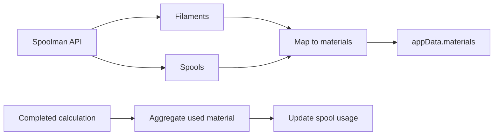

# 3D Print Cost Calculator

[Русская версия](./README_RU.md)

<p align="center">
  <a href="https://github.com/nazbav/3d-price/releases">
    
  </a>
  <a href="https://github.com/nazbav/3d-price/releases">
    
  </a>
  <a href="https://github.com/nazbav/3d-price/pulse">
    
  </a>
  <a href="https://github.com/nazbav/3d-price/stargazers">
    
  </a>
  <a href="https://github.com/nazbav/3d-price/network/members">
    
  </a>
</p>

<p align="center">
  <a href="https://github.com/nazbav/3d-price">Repository</a> •
  <a href="https://github.com/nazbav/3d-price/releases">Releases</a> •
  <a href="https://github.com/nazbav/3d-price/pulse">Pulse</a> •
  <a href="https://github.com/nazbav/3d-price/graphs/contributors">Contributors</a> •
  <a href="https://github.com/nazbav/3d-price/graphs/traffic">Traffic</a>
</p>

<p align="center">
  <a href="https://github.com/nazbav/3d-price">
    
  </a>
</p>

<p align="center">
  <a href="https://star-history.com/#nazbav/3d-price&Date">
    
  </a>
</p>

Browser-first calculator for estimating 3D printing jobs. The active application lives in [index.html](./index.html); legacy `index*.html` pages remain in the repository but are not the primary UI anymore.

## Current Scope

- Single-file app in `index.html` with Bootstrap-based UI and inline JavaScript.
- Local-first data model stored in browser `localStorage`.
- Optional Electron wrapper in [`electronapp/`](./electronapp/) for desktop usage, backup tooling, and remote/offline delivery.
- Legacy pages (`index1.html`, `index2.html`, `index3.html`) are historical snapshots, not the main development target.

## What `index.html` Does

- Maintains printers, materials, clients, global overheads, and calculation history.
- Calculates print cost using material, electricity, depreciation, maintenance, operator time, downtime, preparation, shipping, markup, discount, tax, and optional label/estimate printing costs.
- Supports urgency profiles with per-day work schedules.
- Supports per-printer multimaterial mode:
  - printer-level toggle `Мультиматериальная печать`
  - per-model material composition in a modal editor
  - total model weight derived from all material entries
- Imports G-code into calculator rows:
  - drag-and-drop into the calculator area
  - external post-processing flows such as `open_calc.py`
  - printer/material matching memory via local prompt memory
- Parses G-code metadata including print time, thumbnails, printer profile hints, and multimaterial tool usage.
- Generates compact thermal labels and printable estimate/order summary cards.
- Provides analytics in the Summary tab: revenue, profit, cost structure, material usage, printer load, client statistics, and period-based charts.
- Supports JSON import/export and encrypted short-lived cloud sync links/QR codes via Supabase.
- Supports optional Spoolman integration for material import and spool usage updates.

## Main UI Sections

`index.html` currently exposes these top-level sections:

- `Calculate`
- `History`
- `Clients`
- `Printers`
- `Materials`
- `Additional Costs`
- `Settings`
- `Summary`

Settings include branding, calculation rules, cloud sync, Spoolman integration, tax helper fields, interface language, and display currency.

## Quick Start

### Browser

```bash
git clone https://github.com/nazbav/3d-price.git
cd 3d-price
```

Open `index.html` in a modern browser.

Typical workflow:

1. Add printers.
2. Add materials and global overheads.
3. Open `Calculate`.
4. Add models manually or import G-code.
5. Run calculation and save it to history.

### Electron

```bash
cd electronapp
npm install
npm run start
```

Packaging commands:

```bash
npm run make
# or
npm run dist:win
npm run dist:linux
npm run dist:mac
```

Electron-specific details live in [`electronapp/README.md`](./electronapp/README.md).

## How the Calculator Works

This section is a practical architecture map of the calculator. It is written for two audiences at once:

- users who need to understand the correct operating flow;
- developers who need a stable mental model before changing calculation logic, import flows, storage, or Electron behavior.

### System Overview

The active application lives in [`index.html`](./index.html). It acts as a local-first production calculator with optional desktop wrapping through [`electronapp/`](./electronapp/).



### Main User Workflow

For day-to-day use, the calculator is designed around a consistent order flow:

1. maintain reference data;
2. create or open an order in `Calculate`;
3. add models manually or import G-code;
4. verify printer, materials, time, weight, urgency, and pricing modifiers;
5. run the calculation;
6. save the result to history;
7. export labels, estimate cards, or use the data in analytics.



### Functional Modules

At the product level, the calculator is split into a few stable responsibilities:

- reference catalogs: printers, materials, clients, global overheads;
- order composition: models, weights, material entries, statuses, thumbnails;
- calculation engine: material, electricity, depreciation, maintenance, operator time, downtime, preparation, shipping, markup, discount, tax;
- import layer: G-code parsing, printer/material matching, thumbnail extraction, remembered selections;
- persistence: local-first app snapshot, JSON import/export, encrypted short-lived cloud sync;
- reporting: history, summary analytics, estimate HTML, labels;
- optional platform/integration layer: Electron and Spoolman.

### Data Model Overview

The runtime state centers around a single in-memory structure (`appData`) that mirrors what is persisted locally.



For development, the important distinction is:

- reference data lives in catalogs;
- active order state is assembled in the `Calculate` UI;
- completed results are materialized into `lastCalcFullData`;
- saved results become `calcHistory`;
- analytics are computed from `calcHistory`.

### Calculation Pipeline

The calculator builds the final price from multiple cost layers, not just material weight.



In practical terms, the final amount may include:

- materials;
- printer electricity;
- printer amortization;
- maintenance;
- operator work;
- preparation time;
- cooling / downtime effects;
- shipping / packaging;
- markup and discount;
- tax;
- optional estimate-printing or label-printing costs.

### Multimaterial Models

Multimaterial support is implemented as a real data path, not just a UI switch:

- a printer can be flagged as multimaterial;
- a model can contain one or many `materialEntries`;
- the modal editor manages the material composition;
- total model weight is derived from the sum of all entries;
- final material cost is calculated from each entry separately.



This is one of the most sensitive areas for regressions because UI rendering, stored data, weight synchronization, and final cost all depend on the same material-entry structure.

### G-code Import Flow

The calculator supports both direct drag-and-drop and external import flows such as [`open_calc.py`](./open_calc.py).



This flow is useful for both users and contributors:

- users get faster order creation from slicer output;
- developers need to understand that printer matching, material matching, thumbnails, and multimaterial parsing all converge into the same model-row state.

### Persistence and Saved Results

The calculator is local-first. Active state is persisted locally, and completed calculations are transformed into history records.



For maintenance and future changes, this means:

- schema changes affect both current UI state and saved history;
- import/export compatibility matters whenever object shapes change;
- analytics stability depends on the structure of saved history entries.

### Summary / Analytics

The `Summary` tab is a reporting layer built on top of saved history, not just the current order.

```mermaid
flowchart TD
    A[calcHistory[]] --> B[Filter by period]
    B --> C[Orders aggregation]
    B --> D[Printers aggregation]
    B --> E[Materials aggregation]
    B --> F[Clients aggregation]
    B --> G[Statuses aggregation]

    C --> H[KPI cards]
    D --> I[Printer charts/tables]
    E --> J[Material charts/tables]
    F --> K[Client stats]
    G --> L[Status distribution]

    H --> M[Summary UI]
    I --> M
    J --> M
    K --> M
    L --> M
```

If you change how orders are saved, you should assume `Summary` may need verification as well.

### Electron Layer

Electron is not a separate calculator implementation; it is a desktop wrapper around the same `index.html`.



Desktop mode adds:

- offline delivery;
- backup integration;
- desktop environment detection;
- browser-like rendering with desktop-specific bridge hooks.

### Spoolman Integration

Spoolman is optional and sits beside the core calculator, not inside the primary pricing engine.



It is mainly relevant when users want material catalog synchronization and automatic spool usage tracking after successful calculations.

### What to Check First When Modifying the Calculator

If you change one of these areas, verify the connected flows as well:

- **model row UI**: weight sync, material summary, history details;
- **multimaterial modal**: material entries, total weight, final cost, label/export output;
- **G-code import**: parsed time, printer matching, material matching, thumbnails;
- **history schema**: import/export, saved reload, summary analytics;
- **price logic**: operator cost, tax, markup, discount, preparation, downtime;
- **Electron-specific behavior**: environment detection, offline mode, backup bridge;
- **Spoolman**: mapping, duplicate spool IDs, usage update calls.

### Recommended User Operating Order

For reliable everyday use:

1. maintain `Printers`;
2. maintain `Materials`;
3. maintain `Additional Costs`;
4. configure `Settings` if needed;
5. create the order in `Calculate`;
6. add/import models;
7. verify printers, materials, urgency, and modifiers;
8. calculate;
9. save to history;
10. use exports and analytics as needed.

## G-code Import Notes

The calculator can import G-code and map it into model rows. Current import-related behavior includes:

- printer resolution by parsed printer/profile hints
- remembered material/printer choices in local prompt memory
- multimaterial parsing into per-material entries
- warnings when imported G-code contains multiple materials but the target printer is not marked as multimaterial

Sample files used during development may exist in `g-codes/`, but they are not required for normal app usage.

## Data Storage

- Main application data is stored in browser `localStorage`.
- JSON import/export is available from the UI.
- Cloud sync uses encrypted payloads and short-lived retrieval flow.
- Electron adds local backups on top of the browser data model.

## Development Notes

- Primary file to edit: [`index.html`](./index.html)
- Avoid treating legacy `index*.html` pages as the source of truth for new work.
- Root `test_offline.html` is no longer part of the active root workflow.
- For UI and JavaScript troubleshooting, prefer `lightpanda` smoke/debug runs over the old outdated UI tests.

## Verification

Useful local checks:

- open `index.html` in browser
- run targeted syntax checks for inline scripts
- use `lightpanda` for UI/JS regression hunting when environment allows it
- run Electron manually if changes may affect desktop behavior

### Production Readiness

This repository currently keeps release-facing notes in root-level project files rather than a dedicated `docs/` tree:

- [`FEATURE_LIST.md`](./FEATURE_LIST.md): feature overview
- [`CHANGELOG.md`](./CHANGELOG.md): change history

Before release, verify the active calculator flow, G-code import, multimaterial mapping, label/export output, and Electron wrapper manually.

## Repository Map

- [`index.html`](./index.html): active calculator UI
- [`electronapp/`](./electronapp/): desktop wrapper
- [`g-codes/`](./g-codes/): example/import G-code files when present
- [`FEATURE_LIST.md`](./FEATURE_LIST.md): high-level feature inventory
- [`CHANGELOG.md`](./CHANGELOG.md): release history and notable changes
- [`orcaslicer-calc/`](./orcaslicer-calc/): slicer-related external subtree/work area present in this repo

## Production Readiness / Release Checklist

Supporting references:

- [`FEATURE_LIST.md`](./FEATURE_LIST.md)
- [`CHANGELOG.md`](./CHANGELOG.md)

Top-level release gates:

- **Core calculation** — single and multimaterial cost computation is correct
- **History / storage** — save, reload, edit, delete, export/import all work with the current local-first storage model
- **G-code import** — drag-drop, post-processing bridge, metadata parsing
- **Multimaterial mapping** — full/partial/unknown material match; MM flag warning
- **Estimate / label output** — renders correctly, downloads without clipping
- **English UI** — no Russian leakage in any critical path
- **Electron wrapper** — shared path resolves; packaging produces a working build
- **All modules** — calculator, history, clients, printers, materials, overheads, analytics, My Tax, Spoolman each verified

## License

MIT
