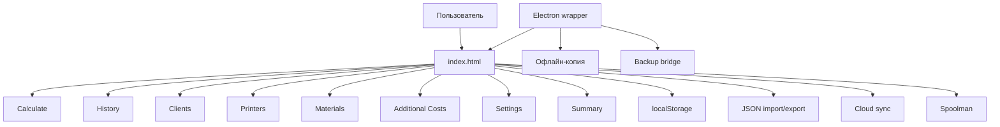
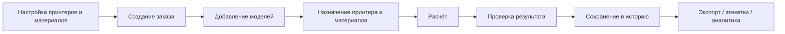
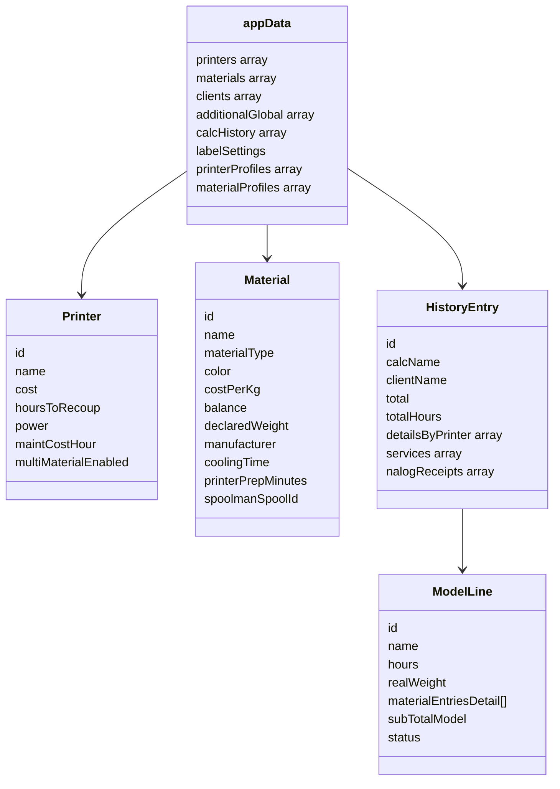
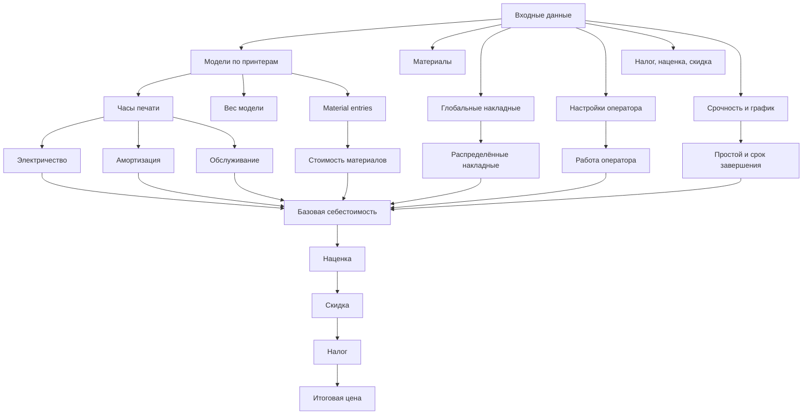
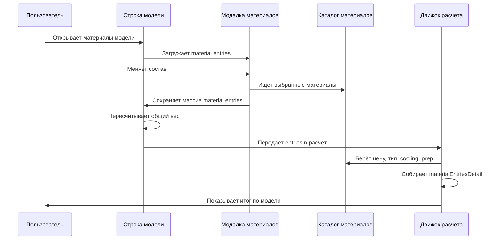
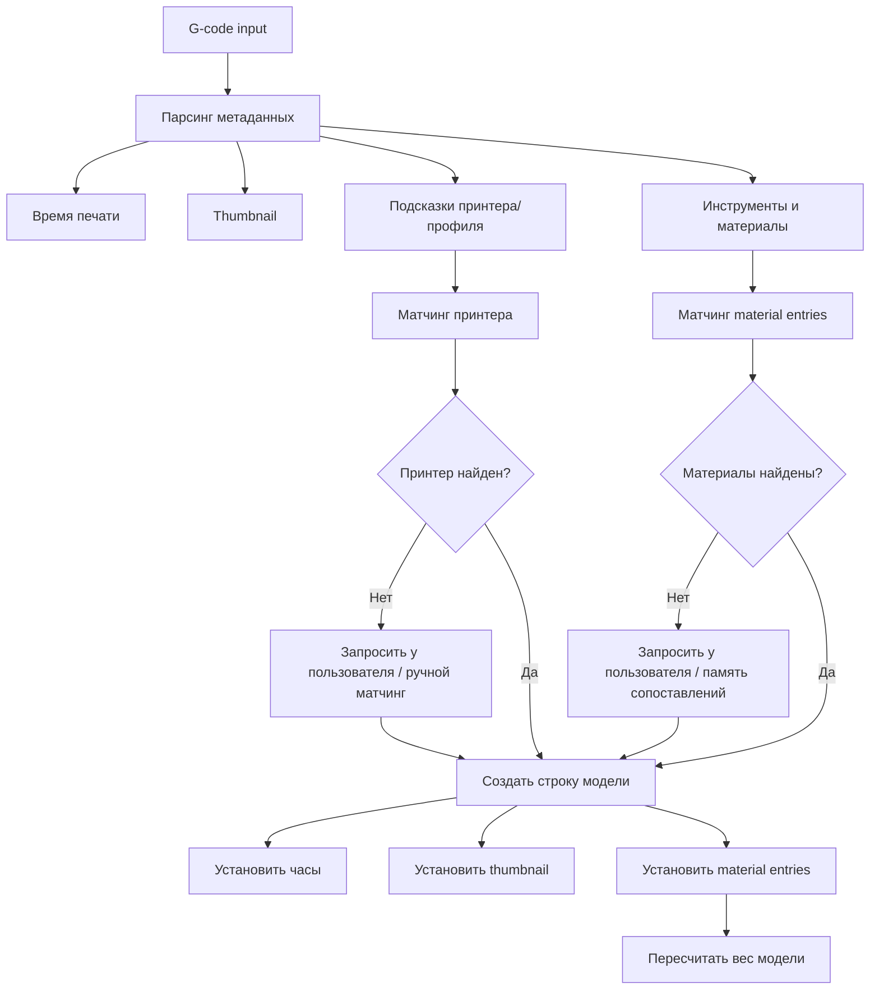
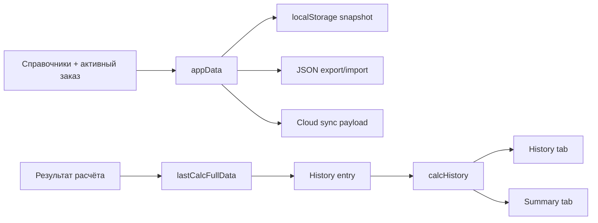
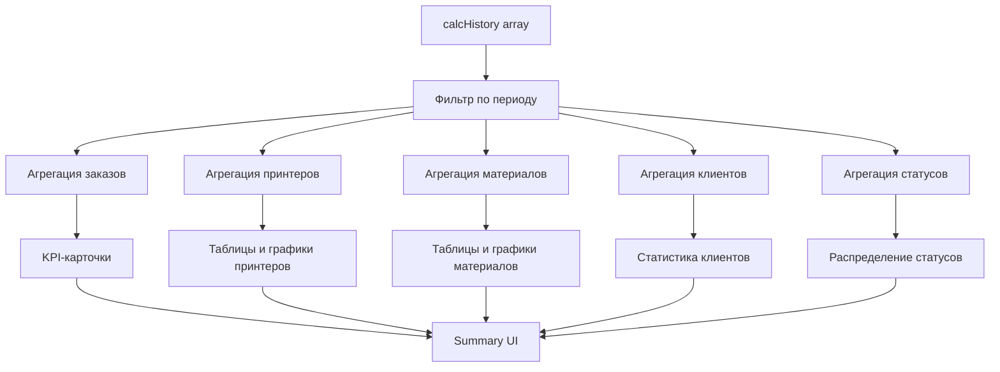
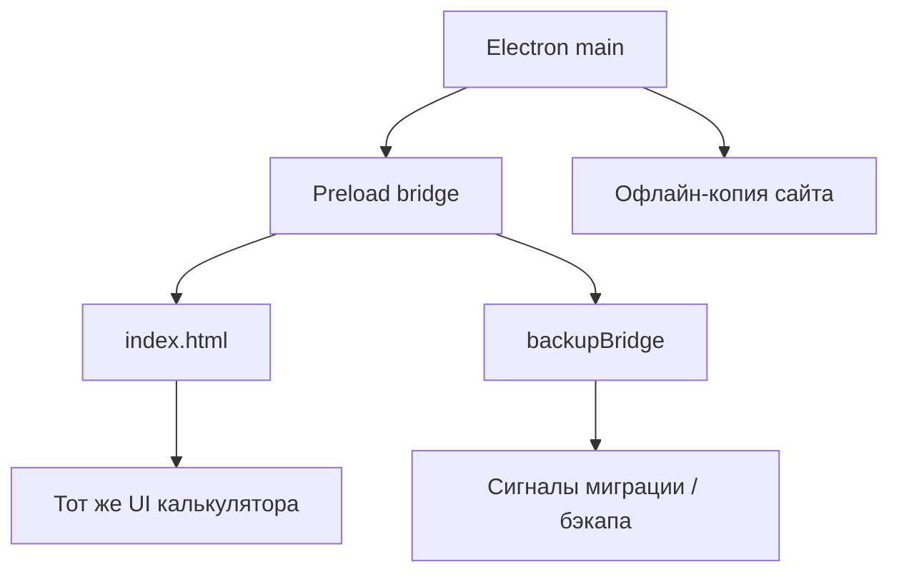
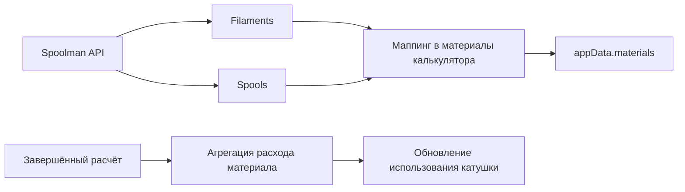

# Калькулятор себестоимости 3D-печати

[English version](./README.md)

<p align="center">
  <a href="https://github.com/nazbav/3d-price/releases">
    
  </a>
  <a href="https://github.com/nazbav/3d-price/releases">
    
  </a>
  <a href="https://github.com/nazbav/3d-price/pulse">
    
  </a>
  <a href="https://github.com/nazbav/3d-price/stargazers">
    
  </a>
  <a href="https://github.com/nazbav/3d-price/network/members">
    
  </a>
</p>

<p align="center">
  <a href="https://github.com/nazbav/3d-price">Repository</a> •
  <a href="https://github.com/nazbav/3d-price/releases">Releases</a> •
  <a href="https://github.com/nazbav/3d-price/pulse">Pulse</a> •
  <a href="https://github.com/nazbav/3d-price/graphs/contributors">Contributors</a> •
  <a href="https://github.com/nazbav/3d-price/graphs/traffic">Traffic</a>
</p>

<p align="center">
  <a href="https://github.com/nazbav/3d-price">
    
  </a>
</p>

<p align="center">
  <a href="https://star-history.com/#nazbav/3d-price&Date">
    
  </a>
</p>

Основной интерфейс проекта находится в [index.html](./index.html). Старые `index*.html` всё ещё лежат в репозитории, но основным UI и точкой актуальной разработки больше не являются.

## Текущий фокус проекта

- Основное приложение собрано в одном файле `index.html` на Bootstrap и inline JavaScript.
- Данные по умолчанию живут локально в `localStorage` браузера.
- Есть обёртка Electron в [`electronapp/`](./electronapp/) для десктопного запуска, локальных бэкапов и доставки интерфейса.
- `index1.html`, `index2.html`, `index3.html` следует воспринимать как legacy-версии.

## Что умеет `index.html`

- Вести справочники принтеров, материалов, клиентов, накладных расходов и историю расчётов.
- Считать стоимость печати с учётом:
  - материалов
  - электричества
  - амортизации
  - обслуживания
  - времени оператора
  - простоя и подготовки
  - доставки
  - наценки, скидки и налога
  - печати этикеток и сметы
- Поддерживать профили срочности и рабочие графики по дням недели.
- Поддерживать мультиматериальную печать:
  - флаг на уровне принтера
  - состав материалов модели через модальное окно
  - общий вес модели как сумму всех материалов
- Импортировать G-code:
  - drag-and-drop в область калькулятора
  - внешний вызов из post-processing сценариев вроде `open_calc.py`
  - запоминание сопоставлений принтеров и материалов через локальную prompt-memory
- Парсить из G-code:
  - время печати
  - превью/thumbnail
  - подсказки профиля принтера
  - мультиматериальные инструменты и материалы
- Генерировать компактные термоэтикетки и печатные карточки/сметы заказа.
- Показывать расширенную сводку:
  - выручка
  - прибыль
  - структура затрат
  - расход материалов
  - загрузка принтеров
  - статистика по клиентам
  - графики по периодам
- Поддерживать JSON import/export и зашифрованные краткоживущие облачные ссылки/QR через Supabase.
- Поддерживать интеграцию со Spoolman для импорта материалов и обновления использования катушек.

## Основные разделы интерфейса

В `index.html` сейчас есть такие верхнеуровневые разделы:

- `Calculate`
- `History`
- `Clients`
- `Printers`
- `Materials`
- `Additional Costs`
- `Settings`
- `Summary`

В `Settings` находятся брендинг, правила калькуляции, облачная синхронизация, Spoolman, налоговые поля, язык интерфейса и валюта отображения.

## Быстрый старт

### В браузере

```bash
git clone https://github.com/nazbav/3d-price.git
cd 3d-price
```

После этого откройте `index.html` в современном браузере.

Обычный сценарий:

1. Добавить принтеры.
2. Добавить материалы и накладные расходы.
3. Открыть `Calculate`.
4. Добавить модели вручную или импортировать G-code.
5. Выполнить расчёт и сохранить его в историю.

### В Electron

```bash
cd electronapp
npm install
npm run start
```

Сборка:

```bash
npm run make
# или
npm run dist:win
npm run dist:linux
npm run dist:mac
```

Подробности по десктопной части вынесены в [`electronapp/README.md`](./electronapp/README.md).

## Как работает калькулятор

Этот раздел нужен сразу в двух режимах:

- как практическая карта для пользователя;
- как архитектурная карта для доработки калькулятора без слепых правок.

### Обзор системы

Активное приложение живёт в [`index.html`](./index.html). Это local-first калькулятор производства с дополнительной десктопной обёрткой в [`electronapp/`](./electronapp/).



### Основной пользовательский сценарий

Рабочий поток калькулятора выглядит так:

1. заполнить справочники;
2. создать или открыть заказ в `Calculate`;
3. добавить модели вручную или импортировать G-code;
4. проверить принтер, материалы, время, вес, срочность и модификаторы цены;
5. выполнить расчёт;
6. сохранить результат в историю;
7. использовать экспорт, этикетки и аналитику.



### Функциональные модули

На уровне продукта система делится на несколько устойчивых зон ответственности:

- справочники: принтеры, материалы, клиенты, глобальные накладные;
- сборка заказа: модели, веса, material entries, статусы, thumbnails;
- движок расчёта: материалы, электричество, амортизация, обслуживание, оператор, подготовка, простой, доставка, наценка, скидка, налог;
- импорт: парсинг G-code, матчинг принтеров и материалов, извлечение preview;
- хранение: локальное состояние, JSON import/export, облачный обмен;
- отчётность: история, summary-аналитика, HTML-смета, этикетки;
- опциональные интеграции: Electron и Spoolman.

### Обзор модели данных

Центральная runtime-структура — это `appData`, в которой лежит почти весь рабочий снимок приложения.



Ключевая логика для доработки:

- справочники живут в каталогах внутри `appData`;
- активный расчёт сначала собирается в UI;
- затем превращается в `lastCalcFullData`;
- после сохранения попадает в `calcHistory`;
- `Summary` строится уже поверх `calcHistory`.

### Пайплайн расчёта

Финальная цена собирается из нескольких слоёв, а не только из веса и стоимости материала.



На практике в расчёт могут входить:

- материалы;
- электричество принтера;
- амортизация;
- обслуживание;
- работа оператора;
- подготовка;
- простой и охлаждение;
- доставка/упаковка;
- наценка и скидка;
- налог;
- дополнительные расходы на печать сметы или этикеток.

### Мультиматериальные модели

Мультиматериальность — это полноценный поток данных:

- принтер может быть помечен как мультиматериальный;
- модель может содержать один или несколько `materialEntries`;
- состав материалов редактируется через модальное окно;
- вес модели вычисляется как сумма всех entries;
- стоимость материалов считается по каждой записи отдельно.



Это одна из самых чувствительных зон для регрессий, потому что здесь завязаны:

- UI строки модели;
- модалка состава материалов;
- синхронизация веса;
- детализация в истории;
- итоговый расчёт.

### Импорт G-code

Импорт поддерживает как drag-and-drop, так и внешний вызов, например через [`open_calc.py`](./open_calc.py).



Для пользователя это ускоряет ввод заказа. Для разработчика это отдельный сложный конвейер, где сходятся:

- время печати;
- сопоставление принтера;
- сопоставление материала;
- превью;
- мультиматериальные инструменты.

### Хранение и сохранённые результаты

Калькулятор работает как local-first система. Активное состояние хранится локально, а завершённый расчёт превращается в запись истории.



Это важно для доработки:

- изменения схемы затрагивают и текущее состояние, и историю;
- совместимость JSON import/export критична;
- аналитика зависит от структуры history entry.

### Summary / аналитика

`Summary` строится поверх сохранённой истории, а не только поверх текущего заказа.



Если меняется структура сохранённого заказа, `Summary` почти всегда нужно перепроверять.

### Electron-слой

Electron не дублирует калькулятор, а оборачивает тот же `index.html` в desktop-среду.



Desktop-режим добавляет:

- офлайн-доставку;
- резервные копии;
- desktop environment detection;
- bridge для десктопных сценариев.

### Интеграция со Spoolman

Spoolman — опциональный слой, который не заменяет основной расчёт, а дополняет каталог материалов и учёт катушек.



Это полезно, если нужно:

- подтягивать каталог материалов из Spoolman;
- автоматически списывать расход после расчёта.

### Что проверять в первую очередь при доработке

Если меняется одна из этих зон, проверьте и связанные потоки:

- **строка модели**: вес, summary материалов, история;
- **модалка мультиматериальности**: entries, общий вес, итоговая стоимость;
- **импорт G-code**: время, принтер, материал, thumbnail;
- **история**: сохранение, перезагрузка, import/export, analytics;
- **логика цены**: оператор, налог, наценка, скидка, подготовка, простой;
- **Electron**: environment detection, offline, backup bridge;
- **Spoolman**: маппинг, дубликаты, списание.

### Рекомендуемый порядок работы для пользователя

Для повседневного использования безопасный порядок такой:

1. заполнить `Printers`;
2. заполнить `Materials`;
3. заполнить `Additional Costs`;
4. при необходимости настроить `Settings`;
5. создать заказ в `Calculate`;
6. добавить или импортировать модели;
7. проверить принтеры, материалы, срочность и модификаторы;
8. выполнить расчёт;
9. сохранить в историю;
10. использовать экспорт и аналитику.

## Что важно про импорт G-code

Калькулятор умеет импортировать G-code прямо в строки моделей. Сейчас это включает:

- подбор принтера по данным из файла
- запоминание выбора принтера и материала в локальной prompt-memory
- разбор мультиматериальных файлов в набор отдельных material entries
- предупреждение, если в G-code несколько материалов, а принтер не помечен как мультиматериальный

Папка `g-codes/` может содержать примеры для разработки и отладки, но для работы калькулятора не обязательна.

## Хранение данных

- Основные данные лежат в `localStorage`.
- Из интерфейса доступны JSON import/export.
- Облачная синхронизация работает через зашифрованный payload и короткоживущую ссылку.
- В Electron поверх этого добавляются локальные резервные копии.

## Заметки для разработки

- Главный файл для изменений: [`index.html`](./index.html)
- Не стоит ориентироваться на legacy `index*.html` как на актуальный источник поведения.
- Корневой `test_offline.html` больше не является частью активного root-workflow.
- Для поиска UI/JS-регрессий лучше опираться на `lightpanda`, а не на старые устаревшие UI-тесты.

## Проверки

Практичные локальные проверки:

- открыть `index.html` в браузере
- прогнать точечные синтаксические проверки inline-скриптов
- использовать `lightpanda` для smoke/debug проверок UI и JavaScript, если окружение это позволяет
- отдельно запускать Electron, если изменения могут задеть desktop-обвязку

### Готовность к релизу

Сейчас в репозитории нет отдельного дерева `docs/` с release-runbook, поэтому актуальные опорные материалы лежат в корне:

- [`FEATURE_LIST.md`](./FEATURE_LIST.md): обзор возможностей
- [`CHANGELOG.md`](./CHANGELOG.md): история изменений

Перед релизом нужно вручную проверить основной сценарий калькуляции, импорт G-code, мультиматериальные кейсы, экспорт/этикетки и Electron-обёртку.

## Карта репозитория

- [`index.html`](./index.html): активный интерфейс калькулятора
- [`electronapp/`](./electronapp/): десктопная оболочка
- [`g-codes/`](./g-codes/): примеры и тестовые G-code, если присутствуют
- [`FEATURE_LIST.md`](./FEATURE_LIST.md): сводка по возможностям
- [`CHANGELOG.md`](./CHANGELOG.md): история релизных изменений
- [`orcaslicer-calc/`](./orcaslicer-calc/): внешний slicer-related subtree/work area внутри репозитория

## Готовность к продакшену / Чеклист релиза

Опорные материалы:

- [`FEATURE_LIST.md`](./FEATURE_LIST.md)
- [`CHANGELOG.md`](./CHANGELOG.md)

Верхнеуровневые условия выпуска релиза:

- **Базовый расчёт** — корректный расчёт для одноматериальных и мультиматериальных заданий
- **История / хранение данных** — сохранение, перезагрузка, редактирование, удаление, экспорт/импорт в текущей local-first модели
- **Импорт G-code** — drag-and-drop, post-processing bridge, парсинг метаданных
- **Мультиматериальное сопоставление** — полное/частичное/неизвестное совпадение; предупреждение при отсутствии флага ММ
- **Смета и этикетка** — корректный рендеринг, загрузка без обрезки содержимого
- **Английский UI** — нет утечки русских строк ни в одном критическом пути
- **Обёртка Electron** — shared path разрешается корректно; сборка даёт рабочий исполняемый файл
- **Все модули** — калькулятор, история, клиенты, принтеры, материалы, накладные расходы, аналитика, «Мой налог», Spoolman — все проверены

## Лицензия

MIT
